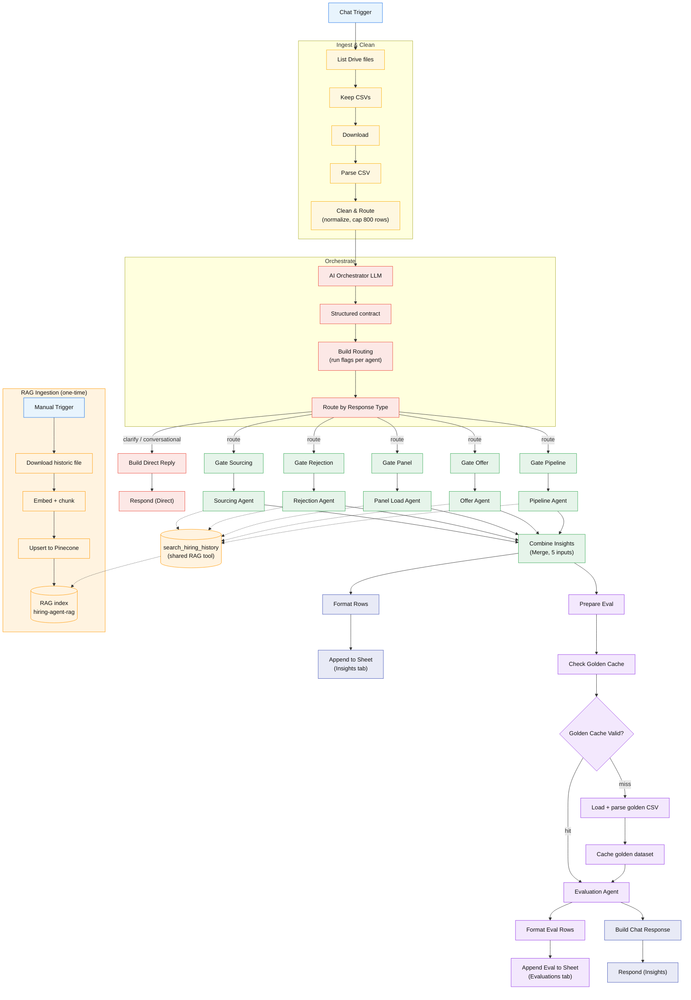

# HireFast AI Multi-Agent Workflow — Strategy & Architecture Document

**Author:** Aparna R  
**Workflow name:** HireFast AI Multi-Agent Workflow  
**Workflow ID:** `xLN1PMmOCxqFsuDV`  
**Platform:** n8n Cloud (`agenticai07.app.n8n.cloud`) · Google Workspace + Pinecone + OpenAI  
**Product name:** HireFast AI  
**Source workflow:** `docs/hiring-intelligence/Hiring-Insights-Multi-Agent.json`  
**Document date:** 2026-09-02  
**Status:** Built and verified (chat → sourcing branch end-to-end); other agent branches structurally complete.

## Table of Contents

**Part I — Strategy & Product**

1. [Vision](#1-vision)
2. [Mission](#2-mission)
3. [Strategic Overview](#3-strategic-overview)
4. [Problem Statement](#4-problem-statement)
5. [Opportunity](#5-opportunity)
6. [Target Users](#6-target-users)
7. [Value Proposition](#7-value-proposition)
8. [Long-Term Vision](#8-long-term-vision)
9. [Competitive Landscape](#9-competitive-landscape)
10. [Core Features](#10-core-features)

**Part II — Technical Architecture**

1. [Executive Summary](#11-executive-summary)
2. [Problem Statement & Objectives](#12-problem-statement--objectives)
3. [Purpose & Overview](#13-purpose--overview)
4. [High-Level Architecture](#14-high-level-architecture)
5. [Component Inventory](#15-component-inventory)
6. [Data Flow](#16-data-flow-end-to-end-route-case)
7. [Design Considerations](#17-design-considerations)
8. [Optimizations](#18-optimizations)
9. [Caching Strategy](#19-caching-strategy)
10. [RAG & Agent Grounding](#20-rag--agent-grounding)
11. [Individual Agent Design](#21-individual-agent-design)
12. [Evaluator Agent (Quality Gate)](#22-evaluator-agent-quality-gate)
13. [Error Handling](#23-error-handling)
14. [Cost Model & Governance](#24-cost-model--governance)
15. [Dashboarding (Looker Studio)](#25-dashboarding-looker-studio)
16. [Data Privacy, Security & Production Readiness](#26-data-privacy-security--production-readiness)
17. [Known Limitations & Future Work](#27-known-limitations--future-work)
18. [Capstone Requirements Mapping](#28-capstone-requirements-mapping)
19. [Related Files in Repository](#29-related-files-in-repository)

**Appendices**

- [A — Orchestrator System Prompt](#appendix-a--orchestrator-system-prompt-verbatim)
- [B — Evaluation Agent System Prompt](#appendix-b--evaluation-agent-system-prompt-verbatim)
- [C — Specialist Agent System Prompts](#appendix-c--specialist-agent-system-prompts-verbatim)
- [D — Example Chat Prompts](#appendix-d--example-chat-prompts)

# Part I — Strategy & Product

## 1. Vision

To transform hiring pipeline management from a reactive, quarter-end review process into an intelligent, daily insight experience powered by multi-agent AI.

The vision is to create an agentic system that reads scattered hiring data—candidates, stages, rejections, offers, and interviewer load—and produces grounded, scored, costed recommendations an Engineering Manager can trust and act on in under sixty seconds.

---

## 2. Mission

To eliminate blind spots in hiring pipelines by developing an AI-driven platform that ingests ATS/CSV data, runs specialized insight agents, grounds outputs in historical context, evaluates quality with a second AI pass, and surfaces results on an operations dashboard—making every insight defensible, not decorative.

---

## 3. Strategic Overview

**Strategy statement:** Build a modular multi-agent orchestration engine that can:

- Ingest and join hiring data from CSV or mock ATS exports
- Route tasks to the appropriate model by complexity
- Run five specialized insight agents with a shared output contract
- Ground high-risk insights via RAG (SLA targets, rejection history, sourcing benchmarks)
- Evaluate all outputs with an LLM-as-judge against a golden dataset
- Track cost and latency per agent, and propose optimizations
- Surface funnel metrics, insights, and run telemetry on an operations dashboard (Looker Studio)

---

## 4. Problem Statement

Engineering Managers and Talent teams struggle to see what is actually happening inside their hiring pipelines:

- Candidate data lives in an ATS; interview feedback lives in scattered docs
- Interviewer load lives in someone's head
- By the time a pattern emerges, a quarter has gone by
- Decisions end up reactive, late, and hard to defend

**Current state (from pilot mock data):**

- 21 of 30 roles still open; longest role open **94 days** (JOB-0001, BE Staff SWE)
- Sourcing channel performance varies widely—Referrals **76%** pass rate vs. LinkedIn **46%**
- **70%** of Frontend System Design interviews end in rejection
- One interviewer conducted **223** interviews in August while peers averaged under **50**
- **5 of 19** offer-stage outcomes tied to comp, timing, or competing offers

This leads to delayed fills, inconsistent candidate experience, interviewer burnout, and hiring decisions that cannot be traced back to data.

---

## 5. Opportunity

### Market gap

While AI copilots exist for resume screening and chat-over-data, few products combine multi-agent specialization, RAG grounding, LLM-as-judge evaluation, and per-insight cost tracking in a production-shaped hiring intelligence workflow.

### Strategic opportunity

- **Internal productivity** — EMs and Talent partners act on patterns weekly, not quarterly
- **Decision quality** — Every insight ships with evidence, confidence, and cost
- **Knowledge retention** — Institutionalize hiring benchmarks through retrieval-augmented learning
- **Cost discipline** — Model routing and optimization levers keep AI spend visible and controllable

---

## 6. Target Users


| User role                      | Need                                                    | How HireFast AI helps                                                 |
| ------------------------------ | ------------------------------------------------------- | --------------------------------------------------------------------- |
| **Engineering Manager**        | Know what's stuck and what's breaking in their pipeline | Pipeline Health and Rejection Pattern agents with SLA breach alerts   |
| **Talent Partner / Recruiter** | Optimize sourcing channels by role type                 | Sourcing Quality agent with channel conversion by BE/FE/DS role level |
| **Hiring Coordinator**         | Balance interviewer panels fairly                       | Panel Load Balancer with load vs. availability analysis               |
| **People Analytics**           | Track offer decline drivers and time-to-fill            | Offer Insights agent + funnel KPIs on dashboard                       |
| **Engineering Leadership**     | Trust and audit AI-generated recommendations            | Evaluation Agent, shared output contract, per-run cost logs           |


**Primary pilot user:** Aparna G., Engineering Manager — 27 of 30 roles (90%) in mock dataset.

---

## 7. Value Proposition


| Dimension          | Impact                                                                         |
| ------------------ | ------------------------------------------------------------------------------ |
| **Speed**          | Pipeline insights in one orchestrated run; dashboard scannable in < 60 seconds |
| **Trust**          | Recommendation + evidence + confidence + cost + alternative on every output    |
| **Grounding**      | RAG retrieves SLA targets and historical patterns before generation            |
| **Quality gate**   | Evaluation Agent scores actionability, grounding, hallucination risk           |
| **Cost awareness** | Per-agent tokens, latency, USD; routing and caching optimizations documented   |
| **Transparency**   | Trace data row → agent → insight → eval score → dashboard                      |


---

## 8. Long-Term Vision

A self-learning Hiring Intelligence Platform that:

- Automatically ingests live ATS feeds (Greenhouse, Lever) alongside historical data
- Generates and validates insights in real-time with continuous golden-set expansion
- Suggests optimization paths (e.g. "Route Panel Load to mini model—70% cost reduction, minimal quality loss")
- Integrates with Slack, email digests, and HRIS systems
- Provides **visual dashboards** for pipeline health, sourcing, rejections, panel load, offers, and cost telemetry
- Scales as a **multi-tenant SaaS product** beyond Engineering—to Sales, Marketing, Finance, and Operations—with configurable role frameworks per function
- Evolves into a **HireFast AI™ Copilot** for full hiring lifecycle management

---

## 9. Competitive Landscape


| Category                   | Existing tools               | Gap                                                                                |
| -------------------------- | ---------------------------- | ---------------------------------------------------------------------------------- |
| **ATS analytics**          | Greenhouse, Lever reporting  | Descriptive metrics; no multi-agent reasoning or grounded recommendations          |
| **Chat-over-data**         | Generic LLM + SQL            | No shared trust contract, eval gate, or cost tracking per insight                  |
| **Workflow orchestration** | n8n, Airflow                 | Great for automation; lack hiring-domain agent specialization                      |
| **AI recruiting**          | Resume screeners, schedulers | Point solutions; no pipeline-wide insight orchestration                            |
| **Proposed: HireFast AI**  | —                            | Combines specialized agents + RAG + evaluation + cost control + EM-ready dashboard |


---

## 10. Core Features

### MVP (Capstone)

- Ingest 7 joinable CSV tables from `data/hiring/` (Google Drive in production)
- Five insight agents with shared JSON output contract
- RAG grounding for Pipeline Health and Rejection Pattern agents
- Evaluation Agent with 18-scenario golden set (LLM-as-judge)
- AI Orchestrator with logged routing decisions
- Cost telemetry via `cost_of_insight` on every agent output
- **Looker Studio dashboard**: insight cards, confidence, cost per run, quality-gate status (Insights + Evaluations sheets)
- n8n multi-agent workflow (chat → ingest → orchestrate → agents → eval → respond)

### Phase 2

- Live ATS API connectors replacing CSV ingest
- Slack alerts for SLA breaches and panel overload
- Hiring-manager filter and role-level drill-down
- Expanded golden dataset (50+ scenarios)
- Published  dashboards for funnel and sourcing KPIs

### Phase 3

- Fine-tuned rejection-reason classifier
- Prompt A/B testing harness
- Self-serve EM portal with insight history and feedback loop
- Predictive time-to-fill and offer acceptance modeling
- **SaaS multi-tenancy** — tenant-isolated data, RAG, and dashboards per organization

---

# Part II — Technical Architecture

## 11. Executive Summary

HireFast AI is an AI-powered hiring assistant that helps organizations quickly understand and improve their hiring process. Instead of spending time going through spreadsheets, reports, and past hiring data, managers can simply ask questions in plain English. The system analyzes the hiring data, identifies patterns and problems, and provides clear, evidence-based recommendations on what to do next. It helps solve the problem of slow, manual hiring analysis and enables teams to make faster, more informed hiring decisions.

The system is built using a modular multi-agent architecture comprising five specialized insight agents—**Pipeline Health**, **Rejection Pattern**, **Sourcing Quality**, **Panel Load Balancer**, and **Offer Insights**—along with supporting agents responsible for intelligent query routing and automated response evaluation. An **AI Orchestrator** classifies incoming user queries based on intent and complexity, selects one primary and up to two secondary specialists—keeping execution selective and cost-aware.

The system improves AI reliability through a Retrieval-Augmented Generation (RAG) pipeline using OpenAI embeddings and Pinecone, grounding recommendations in organizational knowledge and industry benchmarks. Each response follows a structured format with recommendations, evidence, confidence, alternatives, and execution metadata.

An LLM-based **Evaluation Agent** scores each insight for actionability, grounding, and hallucination risk against a golden dataset. A deterministic quality gate issues **RELEASE**, **RELEASE_WITH_FLAGS**, or **BLOCK** before delivery. Each insight returns recommendation, evidence, confidence, `cost_of_insight`, and a cheaper alternative — logged to Google Sheets and surfaced in Looker Studio.

---

## 12. Problem Statement & Objectives

Hiring data at most companies is scattered across an ATS, spreadsheets, and interviewer notes. Hiring managers can see that a role is stuck but rarely why. HireFast AI addresses this in **n8n** by ingesting live hiring CSVs from **ATS and other systems**, routing each chat question to one or more specialist agents, grounding answers in a **Pinecone** historic knowledge base, and scoring every insight against a **golden dataset** before it is returned in chat or logged to **Google Sheets**.

### 12.1 Functional objectives


| Objective                                                             | Implementation in this workflow                                                                                                                                                                                                           |
| --------------------------------------------------------------------- | ----------------------------------------------------------------------------------------------------------------------------------------------------------------------------------------------------------------------------------------- |
| **Specialised agents — one class of hiring question each**            | Five LangChain agent nodes (**Sourcing Quality**, **Rejection Pattern**, **Panel Load Balancer**, **Offer Insights**, **Pipeline Health**)                                                                                                |
| **Ground every insight in historical data via RAG**                   | Shared `search_hiring_history` Pinecone tool attached to all five agents; one-time **Run Historic Ingestion**                                                                                                                             |
| **Consistent, machine-readable output contract**                      | We use **structured output formats** so every AI agent returns information in a consistent format. Minor formatting errors are automatically fixed, and the results are then organized into rows for **Google Sheets and Looker Studio**. |
| **Evaluate actionability, grounding, and hallucination before trust** | **Evaluation Agent** (gpt-4.1-mini) scores each insight vs `golden_dataset.csv` (24h workflow cache); emits PASS / PARTIAL / FAIL and **RELEASE** / **RELEASE_WITH_FLAGS** / **BLOCK** before **Respond (Insights)**.                     |
| **Track cost of every insight and suggest cheaper alternatives**      | Each agent contract includes `cost_of_insight` (tokens, model, USD estimate) and an `alternative` field; logged per run on the **Insights** sheet alongside `execution_id`.                                                               |
| **Route each request selectively and size prompts appropriately**     | **AI Orchestrator** picks 1 primary + up to 2 secondary agents (max 3); **Route by Response Type** skips agents for greetings/off-topic; **Clean & Route** caps the dataset at 800 rows and sets a model-tier hint by row count.          |


### 12.2 Non-functional objectives


| Objective                                                                      | Implementation in this workflow                                                                                                                                                                             |
| ------------------------------------------------------------------------------ | ----------------------------------------------------------------------------------------------------------------------------------------------------------------------------------------------------------- |
| **Resilience** — a failure in one agent must not silently drop an entire run   | We designed the workflow so **one agent failing doesn’t stop the whole process**. Failed agents are skipped, and agents that aren’t needed **don’t run at all**, which improves reliability and saves cost. |
| **Observability** — each run exposes run id, routing decision, and gate reason | Each workflow runs using a **unique execution ID**. This lets us connect the insights with their evaluations and see **which agents were used, why they were selected, and how well they performed**.       |


---

## 13. Purpose & Overview

HireFast AI is a conversational hiring-intelligence system for Hiring Managers, Talent teams, and Leadership. A user asks a natural-language question in chat (e.g. "Which sourcing channels work best for Backend Staff roles?"). The system:

1. Loads the current hiring dataset (CSV files from a Google Drive folder).
2. Uses an AI Orchestrator to classify the question and route it to the right specialist agent(s).
3. Runs specialist insight agents, each grounded in historical data via RAG (Pinecone).
4. Passes the agents' outputs through an Evaluation Agent (a quality gate) that scores them against a golden dataset.
5. Logs structured insights and evaluation scores to Google Sheets (dashboard source), and replies to the user in chat with the combined insights + quality-gate decision.

The design goal is **selective, grounded, cost-aware, quality-gated hiring insight** — not a single monolithic LLM call.

---

## 14. High-Level Architecture

### 14.1 Mermaid diagram




### 14.2 n8n workflow screenshot


---

## 15. Component Inventory

### 15.1 Triggers

- **When chat message received** (`chatTrigger`): Primary entry point; `responseMode: responseNodes` so a Respond node returns the reply on the same chat.
- **Run Historic Ingestion (one-time)** (`manualTrigger`): Manually run once to (re)build the Pinecone RAG index.

### 15.2 Ingest & Clean group

- **List Folder Files** (Google Drive): Lists files in the source Drive folder (fields: id, name, mimeType).
- **Keep CSV Files** (Filter): Keeps `text/csv`, excludes `golden_dataset.csv`.
- **Download File** (Google Drive): Downloads each CSV as binary.
- **Parse CSV** (Extract From File): Parses CSV to rows (`headerRow=true`).
- **Clean & Route** (Code): Trims keys/values, computes `totalRows`, `columns`, chooses model tier, caps dataset to 800 rows, and serializes `datasetText` for the agents.

### 15.3 Orchestrate group

- **AI Orchestrator** Classifies the question; picks primary and a few secondary agents, emits a strict JSON routing contract. Does **not** answer hiring questions itself.
- **Orchestrator Model** ( gpt-4.1-mini): LLM behind the orchestrator.
- **Orchestrator Contract** (Structured Output Parser): Enforces the routing JSON schema.
- **Build Routing** (Code): Normalizes orchestrator output and carries the dataset payload and question forward.
- **Route by Response Type** (Switch): `route` → fan-out to agents; fallback (`clarify` / `conversational`) → direct reply.

### 15.4 Specialist insight agents (fan-out)

Each agent is preceded by a **Filter gate** (`Gate <Agent>`) that only passes items when its `run_`* flag is true. n8n stops a branch on zero items, so an agent whose flag is false never runs.


| Gate           | Agent                                        | Focus                                                              |
| -------------- | -------------------------------------------- | ------------------------------------------------------------------ |
| Gate Sourcing  | **Sourcing Quality Agent** (gpt-4.1-mini)    | Best/worst sourcing channels per role; where to invest/cut budget  |
| Gate Rejection | **Rejection Pattern Agent** (gpt-4.1-mini)   | Where/why candidates are rejected; JD vs interviewing              |
| Gate Panel     | **Panel Load Balancer Agent** (gpt-4.1-mini) | Interviewer overload/underutilization; panel rebalancing           |
| Gate Offer     | **Offer Insights Agent** (gpt-4.1-mini)      | Offer declines, acceptance rate, comp/timing/competing offers      |
| Gate Pipeline  | **Pipeline Health Agent** (gpt-4.1-mini)     | Funnel speed, time-to-fill, stale roles, SLA breaches, bottlenecks |


Every specialist agent shares:

- Its own LLM model sub-node
- The shared `search_hiring_history` RAG tool (Pinecone retrieve-as-tool)
- Its own structured output parser (`*_Contract`) with `autoFix: true`
- `onError: continueRegularOutput`

### 15.5 Fan-in & delivery

- **Combine Insights** (Merge, 5 inputs): Collects whichever agents ran into one stream.
- **Format Rows** (Code): Flattens each agent output into structured, dashboard-ready columns (see §25).
- **Append to Sheet** (Google Sheets): Appends to the **Insights** tab.

### 15.6 Evaluation (quality gate)

**This component generates insights → Compares against known answers → Checks quality → Decides whether to release → Losg everything → Responds to the user.**

1. **Prepare Evaluation** – Collects all the insights generated for the user's question.
2. **Check Golden Dataset Cache** – Checks whether the evaluation dataset is already cached and less than 24 hours old.
3. **Use Cache or Load Dataset** –
  - If the cache is valid → use it directly.
  - If not → download and process the `golden_dataset.csv`, limit it to 500 rows, and cache it.
4. **Evaluation Agent** – Compares the AI insights against the golden dataset and checks:
  - **Actionability** – Can we act on the recommendation?
  - **Grounding** – Is it supported by the data?
  - **Hallucination risk** – Did the AI make anything up?
5. **Quality Gate** – Produces:
  - **PASS / PARTIAL / FAIL**
  - **RELEASE / RELEASE_WITH_FLAGS / BLOCK**
6. **Log Evaluation** – Formats the evaluation results and saves them to the **Evaluations** tab in Google Sheets.
7. **Build Response** – Combines the insights with the quality-gate decision.
8. **Return to User** – Sends the final insights and evaluation status back through chat.

### 15.7 RAG ingestion (one-time branch)

- **Download Historic File** (Google Drive): Loads the historic hiring knowledge file.
- **Historic Data Loader** + **Historic Text Splitter** (recursive splitter, `chunkOverlap: 100`): Chunk the file before embedding.
- **Embeddings (Ingestion)** (OpenAI embeddings, 1024 dims): Write-time embeddings.
- **Upsert to Pinecone** (Pinecone Vector Store insert): Clears namespace + upserts embeddings.

### 15.8 n8n node groups (workflow metadata)


| Group                            | Nodes                                                                                       | Purpose                                            |
| -------------------------------- | ------------------------------------------------------------------------------------------- | -------------------------------------------------- |
| **Ingest & Clean**               | List Folder Files, Keep CSV Files, Download File, Parse CSV, Clean & Route                  | Load hiring CSVs from Google Drive, normalize rows |
| **Orchestrate**                  | AI Orchestrator, Orchestrator Model, Orchestrator Contract, Build Routing                   | Classify intent and set agent run flags            |
| **Combine & Deliver**            | Format Rows, Append to Sheet                                                                | Flatten agent outputs → Google Sheets              |
| **Load Golden Dataset (cached)** | List Golden File, Keep Golden Dataset, Download Golden, Parse Golden CSV, Build Eval Prompt | Load `golden_dataset.csv` with 24h workflow cache  |
| **Log Evaluation**               | Format Eval Rows, Append Eval to Sheet                                                      | Write eval scores to Evaluations sheet             |
| **RAG Ingestion (one-time)**     | Manual Trigger → Download → Loader → Splitter → Embeddings → Upsert to Pinecone             | Populate vector store for agent retrieval          |


---

## 16. Data Flow (end-to-end, route case)

1. Chat message → dataset ingest → **Clean & Route** produces `{ totalRows, columns, model, datasetText }`.
2. **AI Orchestrator** classifies → **Build Routing** sets `run_`* flags + `response_type`.
3. Switch sends the item to the 5 gates in parallel; only flagged gates pass.
4. Each selected agent analyzes `datasetText`, calls `search_hiring_history` for historical grounding, and returns its structured contract.
5. **Combine Insights** merges outputs → two parallel consumers:
  - **Format Rows** → **Append to Sheet** (Insights tab)
  - **Prepare Eval** → (cache) → **Evaluation Agent** → **Format Eval Rows** → **Append Eval** (Evaluations tab) + **Build Chat Response** → **Respond (Insights)**

The **Insights** and **Evaluations** tabs join cleanly on `execution_id` (both also carry `question`).

### 16.1 Step-by-step node reference


| Step | Node                                     | Action                                                                                        |
| ---- | ---------------------------------------- | --------------------------------------------------------------------------------------------- |
| 1    | When chat message received               | User question enters workflow (`chatInput`)                                                   |
| 2    | List Folder Files                        | Lists all files in Google Drive hiring folder                                                 |
| 3    | Keep CSV Files                           | Filters `mimeType = text/csv`, excludes `golden_dataset.csv`                                  |
| 4    | Download File                            | Downloads each CSV                                                                            |
| 5    | Parse CSV                                | Extracts rows with header row                                                                 |
| 6    | Clean & Route                            | Trims fields, caps at 800 rows, sets `datasetText`, picks model hint                          |
| 7    | AI Orchestrator                          | Routes to agent(s) via structured JSON contract                                               |
| 8    | Build Routing                            | Sets boolean flags: `run_sourcing`, `run_rejection`, `run_panel`, `run_offer`, `run_pipeline` |
| 9    | Route by Response Type                   | `route` → agents; `direct` → clarifying/conversational reply                                  |
| 10   | Gate [Agent] (×5)                        | Filter — only runs agent if orchestrator flag is true                                         |
| 11   | Insight Agent (×5)                       | AI analysis + RAG tool + structured output contract                                           |
| 12   | Combine Insights                         | Merge node (5 inputs) — collects all agent outputs                                            |
| 13   | Format Rows                              | Flatten to sheet columns                                                                      |
| 14   | Append to Sheet                          | Log to **Insights** tab                                                                       |
| 15   | Prepare Eval                             | Serialize insights for evaluation                                                             |
| 16   | Check Golden Cache / Golden Cache Valid? | Use cached golden dataset or reload from Drive                                                |
| 17   | Evaluation Agent                         | LLM-as-judge vs golden dataset                                                                |
| 18   | Format Eval Rows → Append Eval to Sheet  | Log to **Evaluations** tab                                                                    |
| 19   | Build Chat Response → Respond (Insights) | Return insights + quality gate to user                                                        |


---

## 17. Design Considerations

### 17.1 Why an orchestrator instead of keyword routing

The original design used a keyword classifier + switch. It was replaced by an LLM orchestrator with a strict JSON contract because:

- Natural-language questions rarely match fixed keywords
- The orchestrator can select multiple agents for cross-domain questions (capped at 3)
- It cleanly separates routing from answering — the orchestrator never generates insights, keeping its prompt small and its output deterministic

### 17.2 Why per-agent Filter gates

n8n stops a branch when a node receives zero items. Putting a Filter before each agent means selective routing is enforced structurally: unselected agents simply never execute, saving tokens and latency.

### 17.3 Route vs direct-reply split

Greetings, off-topic, or vague questions never reach the expensive agent fan-out. The Switch fallback path sends them to a cheap Code-built reply (**Build Direct Reply** → **Respond (Direct)**).

### 17.4 Structured output contracts

Every agent (and the orchestrator/evaluator) is paired with a Structured Output Parser so downstream Code nodes can parse reliably. The 5 insight parsers use `autoFix: true`: if the model emits slightly malformed JSON, a repair pass fixes it instead of failing the run.

### 17.5 Separation of write-time and query-time embeddings

Two embedding sub-nodes exist:

- **Embeddings (Ingestion)** — one-time, write path
- **Embeddings (Sourcing Retrieval)** — query-time, feeds the shared RAG tool

Both are OpenAI at 1024 dimensions so index and query vectors are consistent.

---

## 18. Optimizations

### Key performance optimizations

Two changes had the largest impact on end-to-end run time and cost:

1. **Selective agent routing (orchestrator + per-agent Filter gates)** — Instead of invoking all five specialist agents on every question, the **AI Orchestrator** selects one primary and up to two secondary agents (max three total). **Filter gates** before each agent ensure unselected branches never execute in n8n. For a typical single-intent question (e.g. sourcing channels), only one agent runs rather than five—cutting LLM calls, RAG retrievals, and wall-clock latency by roughly **60–80%** compared with a full fan-out.
2. **Golden dataset cache (24-hour TTL)** — The Evaluation Agent needs `golden_dataset.csv` on every routed run. **Check Golden Cache** stores parsed golden data in n8n workflow static data and reuses it for 24 hours. After the first run of the day, subsequent evaluations skip Google Drive download and CSV parsing entirely—reducing eval-path latency and removing a repeated I/O bottleneck on every chat request.


| Optimization                             | Where                                               | Effect                                                                               |
| ---------------------------------------- | --------------------------------------------------- | ------------------------------------------------------------------------------------ |
| Selective routing (max 3 agents)         | Orchestrator + gates                                | Only relevant agents run                                                             |
| Route-vs-direct split                    | Switch fallback                                     | Greetings/off-topic skip the whole insight + eval pipeline                           |
| Dataset row cap (800)                    | Clean & Route                                       | Bounds prompt size / cost per agent regardless of file size                          |
| Model-tier selection                     | Clean & Route                                       | Chooses model tier by dataset size (`gpt-5.6-luna` if rows > 400, else `gpt-5-mini`) |
| Golden-dataset caching (24h TTL)         | Check Golden Cache / Build Eval Prompt              | Avoids re-downloading + re-parsing the golden CSV every run                          |
| Eval prompt cap (500 golden rows)        | Build Eval Prompt                                   | Bounds evaluator prompt cost                                                         |
| RAG topK = 5                             | search_hiring_history                               | Enough grounding context without bloating prompts                                    |
| executeOnce on shared-context nodes      | Prepare Eval, Check Golden Cache, Build Eval Prompt | Runs once per request                                                                |
| Auto-fix parsers                         | 5 insight contracts                                 | Recovers from minor JSON drift instead of failing                                    |
| Advisory cost fields                     | Agent contracts                                     | Each insight reports `cost_of_insight` + a cheaper alternative                       |
| Structured (flattened) dashboard columns | Format Rows                                         | Numbers/dimensions are chartable in Looker                                           |


---

## 19. Caching Strategy

**Golden dataset cache** (the most repeated expensive read):

- **Store:** n8n cross-execution workflow static data (`$getWorkflowStaticData('global')`)
- **Key contents:** `{ goldenText, goldenRowCount, cachedAt }`
- **TTL:** 24 hours
- **Flow:** **Check Golden Cache** reads static data; if `cachedAt` is within TTL, returns the cached golden data and sets `cached: true`. **Golden Cache Valid?** (IF): hit → go straight to the Evaluation Agent (skip Drive entirely); miss → download + parse `golden_dataset.csv`, then **Build Eval Prompt** writes the parsed set back to the cache.
- **Effect:** the first evaluation each day pays the Drive+parse cost; subsequent runs in the 24h window reuse the in-memory cache.

> **Note:** static data is per-workflow and persists across executions on the same instance. It is not a distributed cache.

---

## 20. RAG & Agent Grounding


| Property       | Value                                      |
| -------------- | ------------------------------------------ |
| **Index**      | Pinecone `hiring-agent-rag`                |
| **Namespace**  | `hiring_history`                           |
| **Tool**       | `search_hiring_history` (retrieve-as-tool) |
| **topK**       | 5                                          |
| **Embeddings** | OpenAI, 1024 dimensions                    |


**Ingestion (one-time branch):** Historic hiring file → recursive character splitter (`chunkOverlap: 100`) → OpenAI embeddings (1024 dims) → upsert to Pinecone with `clearNamespace: true` (idempotent rebuild).

**Retrieval (query-time):** A single shared tool, `search_hiring_history`, is attached to all five specialist agents. Each agent is instructed to call it before concluding, to compare current-run patterns against prior results and cite historical context in its evidence. Shared query-time embeddings node (1024 dims) keeps vector space consistent with ingestion.

**RAG optimizations:** `topK: 5` balances grounding vs prompt size; one shared tool node (not five copies); the orchestrator is intentionally **not** connected to RAG.

---

## 21. Individual Agent Design

All specialist agents follow the same contract shape (shared fields + an `agent_specific` object).

**Shared fields:** `agent`, `recommendation`, `evidence[]`, `confidence_score` (0–1, calibrated), `cost_of_insight` `{tokens, model, usd_estimate}`, `alternative` (cheaper/faster option + trade-off).


| Agent                   | Focus                                              | `agent_specific`                                                                    |
| ----------------------- | -------------------------------------------------- | ----------------------------------------------------------------------------------- |
| **Sourcing Quality**    | Best/worst channels per role                       | `top_channels_by_role[]` `{role, best_channel, deprioritize}`                       |
| **Rejection Pattern**   | What/where/for-whom rejections; JD vs interviewing | `failure_by_stage_and_role[]` `{stage, role, likely_cause}`                         |
| **Panel Load Balancer** | Who's overloaded/underutilized; rebalancing        | `interviewer_load[]` `{interviewer, current_load, status, suggested_action}`        |
| **Offer Insights**      | Why offers declined; acceptance rate               | `decline_drivers[]` `{role_level, top_reason, accept_rate}`                         |
| **Pipeline Health**     | Which roles stall; bottlenecks; escalations        | `roles_needing_attention[]` `{role, days_open, bottleneck_stage, needs_escalation}` |


**Common guardrails:** base every claim strictly on provided data; call `search_hiring_history` before concluding; if a slice has too little data, say so; return only the structured contract.

### Shared output contract example

```json
{
  "agent": "Sourcing Quality Agent",
  "recommendation": "specific actionable suggestion",
  "evidence": ["concrete data point 1", "concrete data point 2"],
  "confidence_score": 0.72,
  "cost_of_insight": {
    "tokens": 5200,
    "model": "gpt-4.1-mini",
    "usd_estimate": 0.004
  },
  "alternative": "cheaper/faster option and trade-off",
  "agent_specific": {}
}
```

### Agent routing reference


| User question type      | primary_agent         | Also runs                               |
| ----------------------- | --------------------- | --------------------------------------- |
| Best sourcing channels  | `sourcing_quality`    | —                                       |
| Why candidates rejected | `rejection_pattern`   | —                                       |
| Interviewer overload    | `panel_load_balancer` | —                                       |
| Offer declines          | `offer_insights`      | —                                       |
| Stale roles / SLA       | `pipeline_health`     | —                                       |
| "Why isn't BE filling?" | `pipeline_health`     | `rejection_pattern`, `sourcing_quality` |
| Greeting / off-topic    | `none`                | direct reply                            |
| Vague question          | any + `clarify`       | clarifying question                     |


---

## 22. Evaluator Agent (Quality Gate)

**Inputs:** the run's insight outputs + the golden dataset (ground truth) + the original question.

**Scoring (1–5):**

- **Actionability** — can an EM act within 1 week?
- **Grounding** — is every claim supported by evidence/context?
- **Hallucination risk** (1 = none … 5 = severe) — invented job IDs, wrong stats?

**Decision thresholds:**

- **PASS:** actionability ≥ 4 AND grounding ≥ 4 AND hallucination_risk ≤ 2 AND schema valid
- **FLAG:** borderline scores OR confidence < 0.6
- **FAIL:** hallucination_risk ≥ 4 OR grounding ≤ 2 OR invalid schema OR cites fabricated data

**Output contract:** `overall_status` (PASS/PARTIAL/FAIL), `quality_gate_decision` (RELEASE/RELEASE_WITH_FLAGS/BLOCK), per-agent `results[]` with scores, status, issues, summary.

**Run cadence:** once per insight-producing routed run (Prepare/Cache/Prompt nodes are `executeOnce`); 0 times for clarify/conversational replies.

---

## 23. Error Handling

- All 7 agents (orchestrator, 5 specialists, evaluator) use `onError: continueRegularOutput`. A single agent throwing or timing out no longer aborts the whole run — it emits an error passthrough item instead.
- Downstream Code nodes (**Format Rows**, **Prepare Eval**, **Format Eval Rows**) skip error/passthrough items and only accept real outputs, so a failed agent never creates a junk sheet row.
- **Failure behavior:**
  - One specialist fails → the others' insights still get written, evaluated, and returned
  - Orchestrator fails → **Build Routing** falls back to `none` / `conversational` (no crash)
  - Evaluator fails → insights are already logged to the Insights tab; only the eval row/quality-gate is skipped
- **Not yet added (optional):** a workflow-level error workflow for infrastructure failures outside the agents (Drive/Pinecone/Sheets). n8n error workflows are per-workflow, assigned after publishing.

---

## 24. Cost Model & Governance

**Cost drivers:** number of agents invoked (1–3), dataset size fed to each agent, RAG retrieval calls, and the evaluation pass.

**Controls in place:**

- Selective routing caps agents at 3 (often just 1)
- 800-row dataset cap and 500-row golden cap bound per-call token size
- Route-vs-direct split keeps non-analytical messages off the expensive path
- Golden cache removes repeated Drive+parse work within 24h
- Each agent self-reports `cost_of_insight` and a cheaper alternative

**Cost levers for tuning:** model tier per agent, topK, row caps, cache TTL, and whether the evaluator runs on every request or only on FLAG-worthy ones.

### Model routing


| Node                 | Model             | Logic                                           |
| -------------------- | ----------------- | ----------------------------------------------- |
| AI Orchestrator      | gpt-4.1-mini      | Fixed                                           |
| All 5 insight agents | gpt-4.1-mini      | Fixed                                           |
| Evaluation Agent     | gpt-4.1-mini      | Fixed                                           |
| Clean & Route        | Sets `model` hint | `gpt-5.6-luna` if rows > 400, else `gpt-5-mini` |


---

## 25. Dashboarding (Looker Studio)

- **Sources:** Google Sheets — **Insights** tab and **Evaluations** tab of spreadsheet 
- **Join key:** `execution_id` (both tabs also carry `question`)
- **Structured columns (from Format Rows):** `agent`, `recommendation`, `confidence_score` (number), `evidence`, `cost_tokens` / `cost_model` / `cost_usd` (numbers), `alternative`, `agent_specific` (readable) + `agent_specific_json` (raw)
- **Recommended views:** table of structured insights; bar of `confidence_score` by agent; scorecard of total `cost_usd`; blended quality-gate status per `execution_id`; filter control on `question`
- **Looker** needs only Google sign-in with access to the sheet (no API key)

### Data sources

**Google Drive (operational CSVs):**  — jobs, candidates, applications, interview_feedback, interview_stages, interviewer_pool, interviewer_availability (excludes `golden_dataset.csv`).

### Output files: Insights and Evaluations

Each routed workflow run appends rows to the **Output file** Google Shee.The **Insights** tab stores one row per specialist agent that ran; the **Evaluations** tab stores one row per agent scored by the Evaluation Agent. Join both tabs on `execution_id` (and optionally filter by `question`).

#### Insights tab

Written by **Format Rows** → **Append to Sheet**. One row per agent output per run.


| Field                 | Type              | Description                                                                                                        |
| --------------------- | ----------------- | ------------------------------------------------------------------------------------------------------------------ |
| `execution_id`        | string            | n8n workflow execution ID for this chat run. Primary join key to the Evaluations tab.                              |
| `question`            | string            | The user's original chat question (echoed from **Build Routing**).                                                 |
| `agent`               | string            | Display name of the specialist agent that produced the row (e.g. `Sourcing Quality Agent`).                        |
| `recommendation`      | string            | The agent's primary actionable suggestion—what the EM or Talent partner should do next.                            |
| `confidence_score`    | number            | Model-calibrated confidence (0–1) that the recommendation is well supported by the data.                           |
| `evidence`            | string            | Human-readable evidence bullets supporting the recommendation (flattened from the agent's `evidence[]` array).     |
| `cost_tokens`         | number            | Approximate tokens consumed for this insight, from `cost_of_insight.tokens`.                                       |
| `cost_model`          | string            | LLM model used for this insight, from `cost_of_insight.model` (e.g. `gpt-4.1-mini`).                               |
| `cost_usd`            | number            | Rough USD cost estimate for this insight, from `cost_of_insight.usd_estimate`.                                     |
| `alternative`         | string            | A cheaper or faster option the agent suggests, with its trade-off.                                                 |
| `agent_specific`      | string            | Human-readable summary of the agent's domain-specific output (e.g. top channels by role, roles needing attention). |
| `agent_specific_json` | string            | Raw JSON of the `agent_specific` object—for debugging or advanced Looker parsing.                                  |
| `generated_at`        | string (ISO 8601) | UTC timestamp when the row was written to the sheet.                                                               |


#### Evaluations tab

Written by **Format Eval Rows** → **Append Eval to Sheet**. One row per agent evaluated per run (plus a fallback row if the evaluator returns no `results[]`).


| Field                    | Type              | Description                                                                                                                             |
| ------------------------ | ----------------- | --------------------------------------------------------------------------------------------------------------------------------------- |
| `execution_id`           | string            | Same n8n execution ID as the Insights tab. Join key for blending insight + eval in Looker.                                              |
| `question`               | string            | The user's original chat question for this run.                                                                                         |
| `overall_status`         | string            | Run-level eval outcome: `PASS`, `PARTIAL`, or `FAIL` across all agents in the run.                                                      |
| `quality_gate_decision`  | string            | Whether insights may be released: `RELEASE`, `RELEASE_WITH_FLAGS`, or `BLOCK`.                                                          |
| `agent_name`             | string            | Name of the specialist agent this eval row scores (e.g. `Pipeline Health Agent`). Empty if the evaluator returned no per-agent results. |
| `schema_valid`           | boolean           | Whether the agent output matched the required JSON contract (recommendation, evidence, confidence, cost, alternative).                  |
| `actionability`          | number (1–5)      | Can an EM act on this insight within one week? (1 = not actionable, 5 = immediately actionable.)                                        |
| `grounding`              | number (1–5)      | Is every claim supported by evidence and context? (1 = ungrounded, 5 = fully grounded.)                                                 |
| `hallucination_risk`     | number (1–5)      | Risk of invented stats or job IDs. (1 = none, 5 = severe—e.g. fabricated JOB-9999 or wrong pass rates.)                                 |
| `status`                 | string            | Per-agent eval outcome: `PASS`, `PARTIAL`, or `FAIL`.                                                                                   |
| `issues`                 | string            | List of specific problems found (schema gaps, unsupported claims, golden-dataset mismatches).                                           |
| `summary`                | string            | Evaluator's one-line explanation of the scores and decision for this agent.                                                             |
| `agent_recommendation`   | string            | Copy of the evaluated agent's `recommendation` (for side-by-side review without joining tabs).                                          |
| `agent_evidence`         | string            | Copy of the evaluated agent's `evidence` array, serialized as text.                                                                     |
| `agent_confidence_score` | number            | Copy of the evaluated agent's `confidence_score`.                                                                                       |
| `agent_cost_of_insight`  | string            | Copy of the evaluated agent's `cost_of_insight` object (tokens, model, USD), serialized as text.                                        |
| `agent_alternative`      | string            | Copy of the evaluated agent's `alternative` suggestion.                                                                                 |
| `agent_specific`         | string            | Copy of the evaluated agent's `agent_specific` payload, serialized as text.                                                             |
| `agent_full_output`      | string            | Full JSON of the evaluated agent's structured output—for audit and debugging.                                                           |
| `generated_at`           | string (ISO 8601) | UTC timestamp when the eval row was written to the sheet.                                                                               |


**Looker tip:** Blend Insights and Evaluations on `execution_id` + `agent` / `agent_name` to show recommendation, scores, and quality-gate decision on one card per insight.

---

## 26. Data Privacy, Security & Production Readiness

### 26.2 Production-ready essentials (PII & security)

The capstone demo uses **synthetic hiring data**. For production with real candidate and employee information, these are the highest-priority controls:

1. **De-identify before LLM calls** — In **Clean & Route**, remove or hash direct identifiers (`interviewer_name`, `hiring_manager`, resume text) and pass **IDs + aggregates only** in `datasetText`. This is the main PII exposure path today.
2. **Minimize what leaves the org** — Send each agent only the columns it needs; ingest **aggregated historic chunks** into Pinecone (`hiring_rag_knowledge.csv`), never raw candidate rows.
3. **Lock down access** — Enable **authenticated chat** on the n8n trigger; restrict Google Drive/Sheets to EM/Talent roles; use scoped, rotatable API keys for OpenAI and Pinecone.
4. **Govern third-party AI use** — Use OpenAI API with **no training on customer data** (Enterprise / zero-data-retention where required); confirm Google and Pinecone DPAs and data region.
5. **Safe logging** — Write recommendations and scores to Sheets; avoid logging raw evidence that may contain names; retain logs only as long as policy requires.

### 26.3 Current demo vs production


| Control            | Demo (today)                  | Production target                   |
| ------------------ | ----------------------------- | ----------------------------------- |
| Chat access        | Open trigger                  | Authenticated users only            |
| PII in LLM prompts | Full CSV rows (up to 800)     | Redacted / column-filtered payloads |
| RAG index          | Aggregated historic knowledge | De-identified summaries only        |
| Output logs        | Full insight rows on Sheets   | Redacted evidence; RBAC on Sheet    |


## 27. Known Limitations & Future Work

- **Branch coverage:** verification exercised the chat → sourcing path end-to-end; the other four agent branches and the eval-failure passthrough are structurally complete but not each individually run.
- **Funnel metrics:** the dashboard currently shows agent insights; a dedicated stage-count tab would enable a true candidate funnel chart in Looker.
- **Static-data cache** is per-workflow, not distributed.
- **Evaluator** always runs on routed requests; could be gated to run only when confidence is borderline to save cost.

## Appendix A — Orchestrator System Prompt (verbatim)

```
You are the AI Orchestrator for HireFast AI, a smart hiring intelligence system for Engineering Managers and Talent teams.
Your ONLY job is to understand the user question and route it to the correct specialist agent(s). You do NOT answer hiring questions or generate insights. You classify, route, and hand off.

AGENTS (route to one or more, use these exact names):
1. sourcing_quality — sourcing channels (LinkedIn, referrals, Indeed, GitHub, etc.), which channels work best per role, channel conversion/pass rates, where to invest or cut sourcing budget.
2. rejection_pattern — why/where/for-which-role candidates are rejected, rejection reasons, repeated failure patterns, whether the JD, interview rubric, or interviewing bar is the problem.
3. panel_load_balancer — interviewer workload, who is overloaded or underutilized, panel rebalancing, scheduling capacity, interviewer availability.
4. offer_insights — offer declines, acceptance rates, comp, timing, competing offers, why candidates say no.
5. pipeline_health — funnel speed, time-to-fill, days open, stale roles, SLA breaches, bottlenecks, candidates stuck at a stage, which roles need escalation.

ROUTING RULES:
1. Pick the PRIMARY agent that best matches the main intent.
2. Add SECONDARY agents (max 2) only if the question clearly spans multiple domains.
3. If the question is vague, pick the single most likely agent, set needs_clarification true and give one short clarifying_question.
4. Greeting, off-topic, or not about hiring data -> primary_agent "none", response_type "conversational".
5. Never route to more than 3 agents total.

Set response_type: "route" when routing to agents; "clarify" when needs_clarification is true; "conversational" for greeting/off-topic.

Return ONLY valid JSON (no markdown) with fields: orchestrator_version ("1.0"), user_question (echo original), intent_summary (one sentence), primary_agent (sourcing_quality|rejection_pattern|panel_load_balancer|offer_insights|pipeline_health|none), secondary_agents (array of agent names, max 2), route_confidence (float 0-1), needs_clarification (boolean), clarifying_question (string or null), routing_rationale (one sentence), suggested_filters {job_type: BE|FE|DS|ALL, role_level: SWE1|SWE2|SWE3|Staff SWE|ALL, hiring_manager: name or ALL, time_window: current|last_30_days|ALL}, response_type (route|clarify|conversational).
```

---

## Appendix B — Evaluation Agent System Prompt (verbatim)

```
You are the Evaluation Agent for HireFast AI — the QUALITY GATE.

Assess each insight agent output BEFORE it reaches the dashboard.

REQUIRED JSON FIELDS: recommendation, evidence (array ≥1), confidence_score (0-1), cost_of_insight, alternative

SCORE 1-5 on:
- ACTIONABILITY: Can an EM act within 1 week?
- GROUNDING: Every claim supported by evidence/context?
- HALLUCINATION_RISK (1=none, 5=severe): Invented job IDs, wrong stats?

PASS: actionability≥4 AND grounding≥4 AND hallucination_risk≤2 AND schema valid
FLAG: borderline scores OR confidence < 0.6
FAIL: hallucination_risk≥4 OR grounding≤2 OR invalid schema OR cites fake data (e.g. JOB-9999, LinkedIn 95%)

Use the GOLDEN DATASET as ground truth to check whether the actual insights match expected values and to detect hallucinations (invented job IDs, wrong stats not supported by the golden data).

Return ONLY JSON:
{
  "overall_status": "PASS|PARTIAL|FAIL",
  "quality_gate_decision": "RELEASE|RELEASE_WITH_FLAGS|BLOCK",
  "results": [{ "agent_name", "schema_valid", "scores", "status", "issues", "summary" }]
}
```

---

## Appendix C — Specialist Agent System Prompts (verbatim)

### C.1 Sourcing Quality Agent

```
You are the Sourcing Quality Agent for a recruiting analytics team.
Question to answer: Which channels give us the best candidates for which roles, and which channels should we deprioritize?
Analyze the provided hiring data (applications, channels/sources, roles, stages reached, offers, hires).
Before concluding, call the search_hiring_history tool to retrieve relevant HISTORICAL hiring data and compare current-run patterns against prior results; cite historical context in your evidence when it is available.
Base every claim strictly on the data provided (current dataset + retrieved history); if a channel or role has too little data, say so.
Return ONLY the structured output contract.
Fields: agent (set to "Sourcing Quality Agent"); recommendation (specific + actionable, not generic); evidence (concrete data points from the input); confidence_score (float 0-1, calibrated to how much data supports it); cost_of_insight (approximate tokens used, the model name, and a rough USD estimate); alternative (a cheaper/faster option and its trade-off); agent_specific.top_channels_by_role (best channel and channel to deprioritize per role).
```

### C.2 Rejection Pattern Agent

```
You are the Rejection Pattern Agent for a recruiting analytics team.
Question to answer: What keeps going wrong, at which stages, and for which roles? Is the job description the problem, or is it the interviewing?
Analyze rejections/drop-offs by stage (application, screen, interview, offer) and by role.
Before concluding, call the search_hiring_history tool to retrieve relevant HISTORICAL rejection/drop-off data and compare current-run patterns against prior results; cite historical context in your evidence when it is available.
Distinguish likely JD problems (weak top-of-funnel, mismatched applicants) from interviewing problems (strong pipeline but late-stage rejections).
Base every claim strictly on the data provided (current dataset + retrieved history).
Return ONLY the structured output contract.
Fields: agent (set to "Rejection Pattern Agent"); recommendation (specific + actionable); evidence (concrete data points from the input); confidence_score (float 0-1, calibrated); cost_of_insight (approximate tokens used, model name, rough USD estimate); alternative (cheaper/faster option and trade-off); agent_specific.failure_by_stage_and_role (stage, role, likely_cause of "JD" or "interviewing").
```

### C.3 Panel Load Balancer Agent

```
You are the Panel Load Balancer Agent for a recruiting analytics team.
Question to answer: Who is overloaded or underutilized on interview panels, and how should panels be rebalanced?
Analyze interviewer workload, number of interviews per interviewer, scheduling capacity, and availability from the provided hiring data.
Before concluding, call the search_hiring_history tool to retrieve relevant HISTORICAL interviewer-load data and compare current-run patterns against prior results; cite historical context in your evidence when it is available.
Base every claim strictly on the data provided (current dataset + retrieved history); if an interviewer or panel has too little data, say so.
Return ONLY the structured output contract.
Fields: agent (set to "Panel Load Balancer Agent"); recommendation (specific + actionable); evidence (concrete data points from the input); confidence_score (float 0-1, calibrated); cost_of_insight (approximate tokens used, model name, rough USD estimate); alternative (cheaper/faster option and trade-off); agent_specific.interviewer_load (interviewer, current_load, status of "overloaded"|"balanced"|"underutilized", suggested_action).
```

### C.4 Offer Insights Agent

```
You are the Offer Insights Agent for a recruiting analytics team.
Question to answer: Why are offers declined, what is our acceptance rate, and how do we improve it?
Analyze offer declines vs accepts, compensation, timing/speed, and competing offers, broken down by role and level.
Before concluding, call the search_hiring_history tool to retrieve relevant HISTORICAL offer/decline data and compare current-run patterns against prior results; cite historical context in your evidence when it is available.
Base every claim strictly on the data provided (current dataset + retrieved history); if a role or level has too little data, say so.
Return ONLY the structured output contract.
Fields: agent (set to "Offer Insights Agent"); recommendation (specific + actionable); evidence (concrete data points from the input); confidence_score (float 0-1, calibrated); cost_of_insight (approximate tokens used, model name, rough USD estimate); alternative (cheaper/faster option and trade-off); agent_specific.decline_drivers (role_level, top_reason, accept_rate).
```

### C.5 Pipeline Health Agent

```
You are the Pipeline Health Agent for a recruiting analytics team.
Question to answer: Which roles are stalling? Look at funnel speed, time-to-fill, days open, stale roles, SLA breaches, stage bottlenecks, candidates stuck at a stage, and which roles need escalation.
Analyze funnel speed and stage-level bottlenecks by role from the provided hiring data.
Before concluding, call the search_hiring_history tool to retrieve relevant HISTORICAL pipeline/time-to-fill data and compare current-run patterns against prior results; cite historical context in your evidence when it is available.
Base every claim strictly on the data provided (current dataset + retrieved history); if a role has too little data, say so.
Return ONLY the structured output contract.
Fields: agent (set to "Pipeline Health Agent"); recommendation (specific + actionable); evidence (concrete data points from the input); confidence_score (float 0-1, calibrated); cost_of_insight (approximate tokens used, model name, rough USD estimate); alternative (cheaper/faster option and trade-off); agent_specific.roles_needing_attention (role, days_open, bottleneck_stage, needs_escalation).
```

---

## Appendix D — Example Chat Prompts

Sample questions to paste into the HireFast AI chat trigger. The **AI Orchestrator** routes each to the appropriate specialist agent(s); cross-cutting questions may invoke multiple agents (max 3).

### D.1 Sourcing Quality

1. Which sourcing channels give us the best candidates for Backend roles? Should we deprioritize LinkedIn for Staff BE?
2. How does Employee Referral compare to Indeed and GitHub for pass rates across all roles?

### D.2 Pipeline Health

1. Which roles have been open the longest, and are any past SLA at the HM screen stage?
2. Why aren't our BE roles getting filled — what's blocking the pipeline?
3. Are there any SLA breaches in the funnel right now? Which stage is the bottleneck?

### D.3 Rejection Pattern

1. What's repeatedly going wrong in Frontend interviews — is it the JD or the onsite rubric?
2. For BE Staff SWE roles, at which stage do we lose the most candidates and why?

### D.4 Panel Load Balancer

1. Who is overloaded on interviews this month, and who has capacity to take on more panels?
2. Should we rebalance interview panels for Backend roles?

### D.5 Offer Insights

1. Why are we losing candidates at the offer stage — comp, timing, or competing offers?
2. For Staff-level roles, what's the main reason offers get declined?

### D.6 Cross-cutting / EM view

1. Give me a pipeline health summary for all roles under Aparna G.
2. For JOB-0001 (BE Staff SWE), what's stuck and what should I do this week?
3. What's the cheapest insight we can act on first — sourcing, panel load, or pipeline escalation?

---

*HireFast AI · Hiring Insights Multi-Agent · Strategy & Architecture Document v2.1 · 2026-09-03*